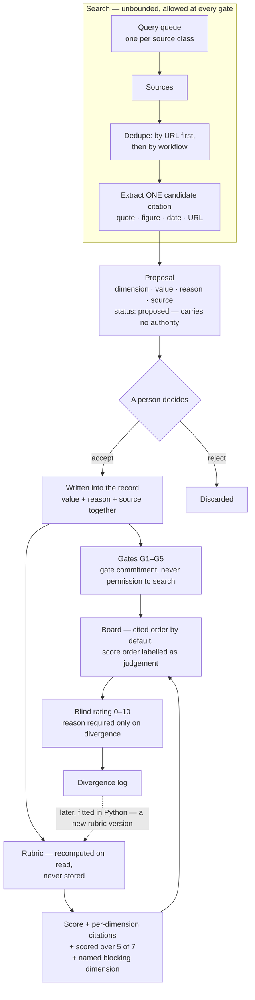

# oppie.lab — the engine, end to end

One picture of where the engine goes, what it looks for, and where scoring sits.

**Nothing here is a new rule.** Every box cites the document it comes from. Where this file and
`RULES.md` or `PAIN_FUNNEL.md` disagree, those win and this file is wrong — tell me and it gets
fixed. The normative version of the analysis behaviour is
`openspec/changes/problem-analysis-rubric/specs/problem-analysis/spec.md`.

## The short version

If the rest of this file is too dense, this is the whole thing:

1. **The engine goes looking for proof that someone already pays** for a piece of work. Job ads are
the best source, because one page shows the budget and describes the work. Government tender notices
are better still. Software price pages show a price is already accepted. Reddit and forums show that
it hurts — but they are **not** proof of money, and the engine must never treat them as if they were.
2. **It keeps the quote**, not a summary, with the link.
3. **It suggests an answer.** Nothing reaches a record until you click accept.
4. **Then each problem gets seven questions**, each answered yes, no, or not-checked-yet, each with
the quote or the field that decided it.
5. **Those seven answers become one number from 0 to 10**, always shown beside three things: how many
questions were checked, how many were not, and which question is blocking the record.
6. **You rate the problem yourself, 0 to 10, before you see the machine's number.** Where the two
disagree you say why, and that disagreement is what moves the weights later.

A **no** pulls the number down. A **not checked yet** is left out and makes the base smaller instead.
Those two are different on purpose: a question nobody has looked at is not a question that failed.

## The whole loop



In words, so the picture is still useful to a reader whose viewer does not render Mermaid: a query
queue feeds sources; sources are deduped by URL and then by workflow, and each one is mined for a
single citation; each citation becomes a proposal; a person accepts it into the record; the rubric
recomputes from the record and is never stored; the board orders by cited facts; a blind rating
produces the divergence log that later moves the weights.

The one arrow that cannot be removed is `HUMAN`. Everything to its left is collection and
suggestion. Nothing crosses it except a click, and the click writes the reason and the source with
the value. That is `RULES.md` § 12, and it is the whole difference between this and an idea
generator.

## Where we go, and what we are looking for

This is `PAIN_FUNNEL.md` § *Where real pain comes from*, with the rule it comes from named and the
thing to bring back spelled out.

| Go to | What it proves | Bring back | Feeds |
|---|---|---|---|
| **Job postings** | A firm is already paying a salary for this workflow, and the posting describes the workaround and the tooling in public (`PAIN_FUNNEL` § G2) | The posting URL, the salary, and the sentence that **is** the workflow | paid today, repetition, buyer |
| **Public procurement / RFPs** | A buyer wrote the requirement down (`RULES.md` § 10: better than job boards) | The clause, quoted, and the contracting body | paid today, buyer, repetition |
| **Vendor pricing pages** | A price is already accepted in this segment | The figure, verbatim, and who buys at it | paid today, competition |
| **Communities — Reddit, forums, trade bodies** | Pain intensity, and the words buyers use for it | A quote in their words, and the workaround they describe | wedge wording, repetition. **Never paid today** |
| **Regulation and deadlines** | The trigger event that forces action | The obligation, the regulator, the date | repetition, consequence, buyer |
| **Reviews of existing tools** | What the incumbent does badly — that is the wedge | The complaint, and who is complaining | competition, wedge specificity |
| **Company pages, headcount, filings** | The size and budget of the buyer | Team size, or the budget line | buyer, market-size proxy |

Two rules that are easy to get wrong:

- **Dedupe by workflow, not only by URL.** The cluster size is a market-size proxy, and the salary
  is an upper bound on willingness to pay that is already being spent (`PAIN_FUNNEL` § *Where real
  pain comes from*). One posting is a signal; four postings for the same workflow at four firms is
  G3.
- **A community source can never answer paid today.** A thread says the pain is real. It says
  nothing about money, and treating it as if it did is the single most likely way this engine starts
  lying (`PAIN_FUNNEL` § G2, "does not count").

### What we are not looking for

Anything that is not one of these is not evidence, however confident it sounds:

- complaints, upvotes, "would you use this" — `PAIN_FUNNEL` § G2
- another founder's enthusiasm
- a market summary with no quote and no URL
- a number with no figure behind it, or a figure with no page behind it

### Query shapes

Starter shapes, not law. Refine them in the engine change; each one is a row in the query queue and
its output is traceable back to it via `foundFor`.

```text
job        "<workflow verb>" ("analyst" OR "specialist" OR "manager") <vertical>
pricing    "<category>" ("pricing" OR "per user" OR "per year")
procure    ("request for proposal" OR "statement of work") "<workflow>" <vertical>
community  site:reddit.com OR site:forum "<workflow>" ("spreadsheet" OR "manually")
regulate   "<regulator>" "<obligation>" ("deadline" OR "from 2026")
reviews    "<vendor>" ("review" OR "alternative") ("too expensive" OR "hard to use")
```

## The unit the engine produces

One source, one citation, one dimension. Not a summary.

```text
CollectedSource                       Proposal
  url          ─────────────┐           dimension    e.g. paid_today
  title                     │           value        yes | no | unknown
  finding      (verbatim     ├─────────▶ reason       the sentence that decided it
               snippet,      │           sourceUrl    the page it came from
               never          │          status       proposed        ← no authority
               paraphrased)   │
  foundFor    (the query)   ─┘           ── a person accepts or rejects ──
  status       new | kept | spent
```

Shapes as shipped in `lib/research.ts`, `CollectedSource` and `Proposal`. The databases tables are
`collected_sources` and `proposals`, and `proposals` refuses an accept with no reason
(`20261001000000_init.sql`, `proposal_acceptance_carries_its_reason`).

## Where scoring sits

Scoring happens **after** the record exists, never during search. It is a pure function of the
record: no clock, no I/O, no network.

```text
record (fields + accepted answers + evidence)
  │
  ├─ 1 wedge specificity   RULES § 3     ─┐
  ├─ 2 paid today          RULES § 11     │
  ├─ 3 repetition          PAIN_FUNNEL G3 │   each dimension →
  ├─ 4 buyer               PAIN_FUNNEL G4 │   yes | no | unknown
  ├─ 5 competition         RULES § 2      │   + the citation that decided it
  ├─ 6 kill-reason quality RULES § 4      │
  └─ 7 citation integrity  product rule  ─┘
                                    │
                                    ▼
                        verdicts, with or without citations
                                    │
                                    ▼   × the weights named by the rubric version
             score  ──  computed on read, NEVER stored
               ├─ range and scale, stated on the surface
               ├─ "scored over 5 of 7"      ← an unknown is not a zero
               ├─ the unknown dimensions, named
               └─ the blocking dimension, named
                                    │
                                    ▼
             blind rating 0–10 ──▶ divergence log ──▶ weights v2 (later, Python)
```

### v1 arithmetic — agreed 2026-10-03

Deliberately the least inventive thing that ranks: **every dimension weighted 1**, `yes` counts `+1`,
`no` counts `−1`, `unknown` counts nothing and shrinks the base. The signed sum is then mapped onto
**0–10**, the same scale as a person's rating, so that "does your rating disagree with the machine?"
is a question with an answer. Comparing `+3 of ±5` against `7 out of 10` would have compared nothing.

```text
raw   = Σ over answered dimensions of  (yes ? +weight : −weight)
max   = Σ over answered dimensions of   weight
score = round( (raw + max) / (2 × max) × 10 )            null when max is 0

shown as   7 / 10   ·   checked 5 of 7   ·   2 not checked   ·   4 yes · 1 no
           4 went yes, 1 went no, 2 were never looked at
           blocking: paid today
```

Four things worth stating, because each one is a way the number could lie:

- **`no` is counted.** `yes` and `no` cancel, so three good answers with two known holes scores below
  three good answers with nothing else known. A yes-only sum cannot tell those two apart.
- **Blanks shrink the base, not the score.** The score is a proportion, so 10 over 5 answers and 10
  over 7 answers are the same number. That is exactly why `checked N of 7` and the not-checked count
  always travel with it — a surface showing the score without the base is showing a number that
  cannot be read.
- **Completeness sorts *first*, not as a tie-break.** Measured over the seeded records on 2026-10-03:
  P-002, with two of seven checked, scored 10/10 — the same as P-001 with six of seven checked and one
  known hole. Sorted by score alone the *least* examined record wins, which is backwards. So the
  order is completeness first, then the score, which is the same rule `PAIN_FUNNEL.md` § Part 2
  already uses for the cited ordering. A number and a caveat can be read apart; an order cannot.
- **Equal weights means nobody has invented a weighting yet.** The tally in `PAIN_FUNNEL.md` §
  *The readiness tally* earns its equal weights the same way. A weight other than 1 has to be earned
  from the divergence log, and arrives as a new rubric version rather than as an edit.

The default **order** on the board stays the cited one (`PAIN_FUNNEL` § Part 2 — Ordering): furthest
gate, then fewest unanswered, then the tally. Ordering by the score is available and labelled as this
system's judgement, because it is not a fact about the world in the way that "passed G3" is.

## Two loops, not one

Worth drawing separately, because conflating them is the mistake that makes the funnel feel like a
blocked pipe:

| | The research loop | The commitment gates |
|---|---|---|
| Bounded by | Nothing | G1 → G5 |
| Runs | At every gate, including from `G1` | Once per record |
| Answers | "What is true here?" | "What may we commit to next?" |
| Withholds | Nothing | Building, or hand-running work for a buyer |

`PAIN_FUNNEL` § *Part 1 — Gates* is explicit: gates gate commitment, not investigation. Reading a
gate as "you may not search until someone already pays" is circular, because the search is how the
paid-today evidence gets found.

## What is not decided here

- **Scheduling.** The engine runs locally on demand (`DECISIONS.md` #6). Watching sources on a
  schedule is a later decision.
- **Which sources get per-source adapters.** Procurement is the likeliest first, on the strength of
  `RULES.md` § 10, but nothing is chosen.
- **Whether the engine may propose candidate *problems***, rather than only verdicts about problems a
  person framed. Open in `DECISIONS.md` #3.
- **Whether the weights are ever fitted.** Ten ratings is not a training signal.
